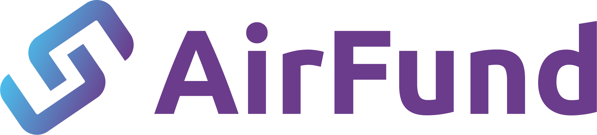
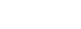
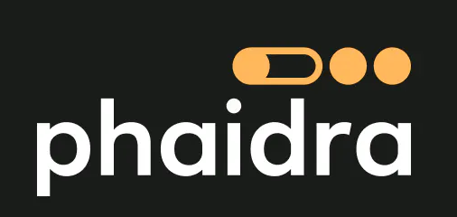
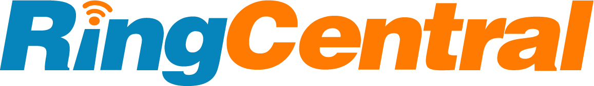
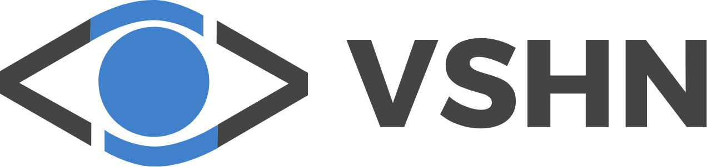
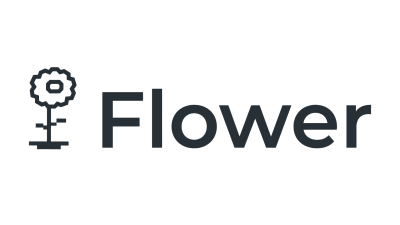

# Who uses **Kapitan**

If you're using **Kapitan** in your organization, please let us know by adding to this list on the [docs/ADOPTERS.md](https://github.com/kapicorp/kapitan/blob/master/docs/ADOPTERS.md) file.

-   [{: style="height:100px"}](https://airfund.io)
-   [{: style="height:100px"}](https://www.isomorphiclabs.com)
-   [{: style="height:100px"}](https://www.morganstanley.com/)
-   [{: style="height:100px"}](https://www.mwam.com/)
-   [{: style="height:100px"}](https://www.nexenio.com)
-   [{: style="height:100px"}](https://www.noon.com/)
-   [{: style="height:100px"}](https://phaidra.ai)
-   [{: style="height:100px"}](https://www.softwareag.com/)
-   [{: style="height:100px"}](https://skyscanner.net/)
-   [{: style="height:100px"}](https://www.synthace.com/)
-   [{: style="height:100px"}](https://www.ringcentral.com/)
-   [{: style="height:100px"}](https://www.ubisoft.com/)
-   [{: style="height:100px"}](https://www.vshn.ch)
-   [{: style="height:100px"}](https://www.flower.ai)

