# Who uses **Kapitan**

If you're using **Kapitan** in your organization, please let us know by adding to this list on the [docs/ADOPTERS.md](https://github.com/kapicorp/kapitan/blob/master/docs/ADOPTERS.md) file.

-   [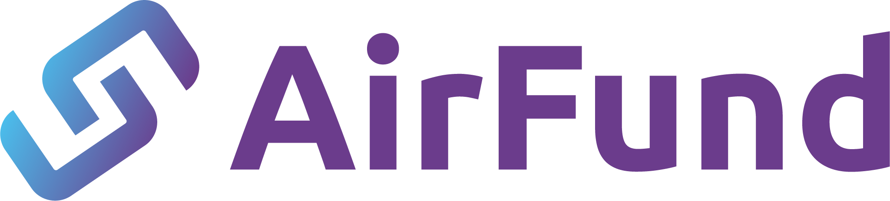{: style="height:100px"}](https://airfund.io){: aria-label="Airfund"}
-   [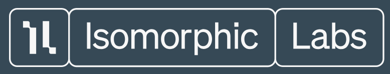{: style="height:100px"}](https://www.isomorphiclabs.com){: aria-label="Isomorphic Labs"}
-   [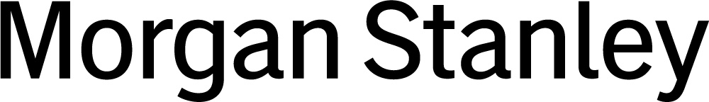{: style="height:100px"}](https://www.morganstanley.com/){: aria-label="Morgan Stanley"}
-   [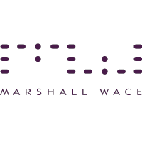{: style="height:100px"}](https://www.mwam.com/){: aria-label="Marshall Wace"}
-   [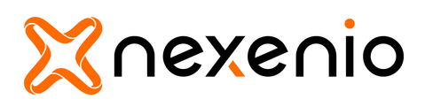{: style="height:100px"}](https://www.nexenio.com){: aria-label="neXenio GmbH"}
-   [{: style="height:100px"}](https://www.noon.com/){: aria-label="noon"}
-   [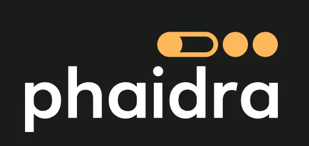{: style="height:100px"}](https://phaidra.ai){: aria-label="Phaidra"}
-   [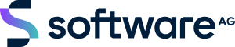{: style="height:100px"}](https://www.softwareag.com/){: aria-label="SoftwareAG"}
-   [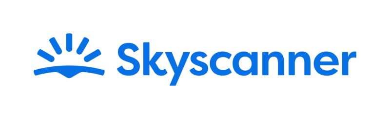{: style="height:100px"}](https://skyscanner.net/){: aria-label="Skyscanner"}
-   [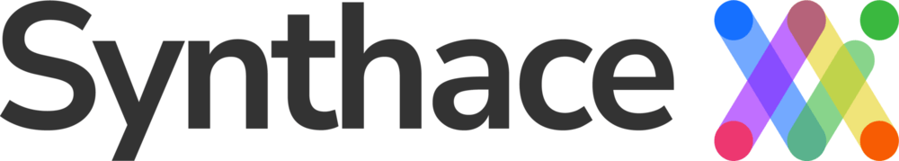{: style="height:100px"}](https://www.synthace.com/){: aria-label="Synthace"}
-   [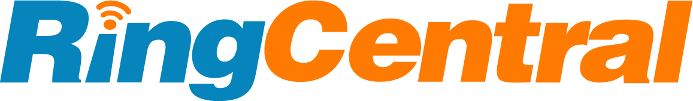{: style="height:100px"}](https://www.ringcentral.com/){: aria-label="RingCentral"}
-   [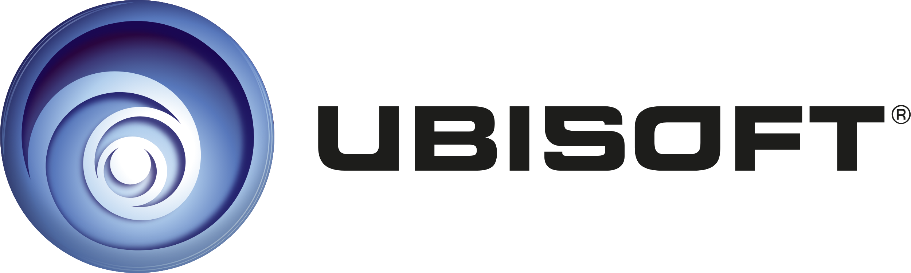{: style="height:100px"}](https://www.ubisoft.com/){: aria-label="Ubisoft"}
-   [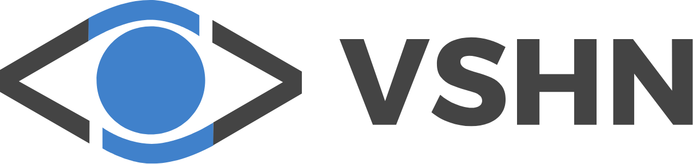{: style="height:100px"}](https://www.vshn.ch){: aria-label="VSHN AG"}
-   [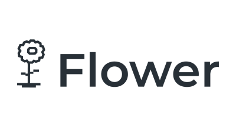{: style="height:100px"}](https://www.flower.ai){: aria-label="Flower Labs"}

