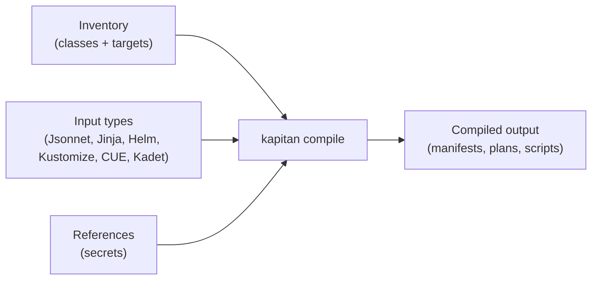

# :kapitan-logo: Kapitan: Keep your ship together


Kapitan is an open source configuration management tool for complex infrastructure systems. It helps teams generate, organize, reuse, validate, and manage Kubernetes, Terraform, and other configuration across environments using inventory, templates, Jsonnet, Jinja2, Kadet, Helm, Kustomize, CUE, and external references.

<div class="grid cards" markdown>

-   :material-rocket-launch:{ .lg .middle } **Quick start**

    ---

    Get up and running in minutes with the [getting started guide](getting_started.md) or the [Kapitan Reference repository](https://github.com/kapicorp/kapitan-reference).

    [:octicons-arrow-right-24: Getting started](getting_started.md)

-   :material-book-open-variant:{ .lg .middle } **Core concepts**

    ---

    Learn how Kapitan uses inventory, targets, classes, and input types to turn templates into structured output.

    [:octicons-arrow-right-24: Read concepts](pages/core_concepts.md)

-   :material-code-tags:{ .lg .middle } **Examples**

    ---

    Explore working examples in the Kapitan Reference repository, covering Kubernetes, Terraform, and multiple input types.

    [:octicons-arrow-right-24: Kapitan Reference](https://github.com/kapicorp/kapitan-reference)

-   :material-handshake:{ .lg .middle } **Contribute**

    ---

    Help improve Kapitan by contributing code, documentation, or feedback. We welcome pull requests and issue reports.

    [:octicons-arrow-right-24: How to contribute](pages/contribute/code.md)

</div>

## What Kapitan does

Kapitan turns a hierarchical inventory and a set of input templates into compiled configuration files ready for deployment. You define reusable classes, per-environment targets, and parameters in YAML. Kapitan compiles them into Kubernetes manifests, Terraform plans, scripts, documentation, or any text-based output you need.



## When Kapitan fits

- You manage the same application across many environments (dev, staging, prod, regions) and need a single source of truth.
- You want to reuse configuration fragments (classes) across targets without copy-paste.
- You need to combine multiple templating tools (Helm, Kustomize, Jsonnet, Jinja2, Python, CUE) in one pipeline.
- You want native secret management (GPG, Vault, AWS KMS, GCP KMS, Azure Key Vault) embedded in the same workflow.
- You prefer a GitOps-friendly compile step that generates fully rendered output before deployment.

## When another tool may be enough

- **Helm alone** is sufficient if you only need to template a single chart with values files and do not share complex configuration across many services.
- **Kustomize alone** is sufficient if your environment differences are mostly patches and overlays on a small set of bases.
- **Plain YAML with a CD tool** is sufficient if you have very few environments and simple configuration with little reuse.
- **Terraform alone** is sufficient if you only manage infrastructure resources and do not need a broader multi-language configuration layer.

## Install and try

### Docker (recommended)

```shell
alias kapitan="docker run -t --rm -v $(pwd):/src:delegated kapicorp/kapitan"
kapitan compile -h
```

### Pip

```shell
pip3 install --user --upgrade kapitan
```

Kapitan requires Python 3.10 or newer.

[:octicons-arrow-right-24: Full installation guide](getting_started.md)

## Trust and community

- **Open source** — MIT license, actively maintained by [KapiCorp](https://github.com/kapicorp).
- **Releases** — regular tagged releases with release notes on [GitHub](https://github.com/kapicorp/kapitan/releases).
- **Community** — ask questions and share patterns in the [`#kapitan`](https://kubernetes.slack.com/archives/C981W2HD3) Slack channel.
- **Related projects** — [Tesoro](https://github.com/kapicorp/tesoro) (Kubernetes admission controller for Kapitan secrets) and [Kapitan Reference](https://github.com/kapicorp/kapitan-reference) (working examples).

[:fontawesome-brands-github: View on GitHub](https://github.com/kapicorp/kapitan) · [:fontawesome-brands-slack: Join #kapitan](https://kubernetes.slack.com/archives/C981W2HD3) · [:material-heart: Sponsor us](pages/contribute/sponsor.md)

## Learn more

### Why Kapitan?

Read the original motivation and design thinking in the blog post: [Why do I need Kapitan?](pages/blog/posts/2022-12-04.md#why-do-i-need-kapitan)

### Video tutorials

!!! info "[Kapitan Youtube Channel](https://www.youtube.com/@kapitandev)"

    === "Inventory"
        <iframe width="1024" height="576" src="https://www.youtube.com/embed/M81qU94FCLQ?si=SGlQG-gP2mmA1n9b" title="YouTube video player" frameborder="0" allow="accelerometer; autoplay; clipboard-write; encrypted-media; gyroscope; picture-in-picture; web-share" allowfullscreen></iframe>

    === "References"
        <iframe width="1024" height="576" src="https://www.youtube.com/embed/I3Ss66zhC50?si=lK4hMtCpxDiJEygH" title="YouTube video player" frameborder="0" allow="accelerometer; autoplay; clipboard-write; encrypted-media; gyroscope; picture-in-picture; web-share" allowfullscreen></iframe>

    === "Helm and Generators integration"
        <iframe width="1024" height="576" src="https://www.youtube.com/embed/clPkDuC2bY4?si=GQwMGNpXuucUTwri" title="YouTube video player" frameborder="0" allow="accelerometer; autoplay; clipboard-write; encrypted-media; gyroscope; picture-in-picture; web-share" allowfullscreen></iframe>

    === "Rawkode: Introduction to Kapitan"
        <iframe width="1024" height="576" src="https://www.youtube.com/embed/8QZvgJi0vII?si=iqLZXv9VvoJD4hTT" title="YouTube video player" frameborder="0" allow="accelerometer; autoplay; clipboard-write; encrypted-media; gyroscope; picture-in-picture; web-share" allowfullscreen></iframe>
