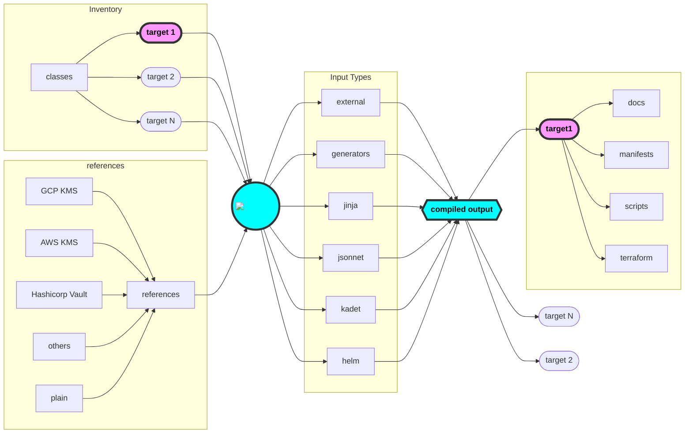

# :kapitan-logo: **Kapitan Overview**

## **Kapitan** at a glance




## Essential concepts

### **Inventory**

The **Inventory** is a hierarchical database of variables, defined in yaml files, that are passed to the targets during compilation. 

The **Inventory** is the heart of **Kapitan**.

Using simple reusable `yaml` files (classes), you can represent as a *Single Source Of Truth* (**`SSOT`**)
everything that matters in your setup, for instance you can define:

* kubernetes `components` definitions
* terraform resources
* business concepts
* documentation and tooling
* ...anything else you want!
  
 Once you have it defined, you can reuse this data can be made available to the many templating engines [***Input types***](#input-types) available to Kapitan.

 Find more detaled explanation in the [inventory](inventory.md) section of the documentation.

### Input types

On compilation, **Kapitan** "renders" the **Inventory** and makes it available to templates that can generate any you any configuration you want, including **Kubernetes manifests**, documentation/playbooks, **Terraform configuration** or even scripts.

#### [**Generators**](https://medium.com/kapitan-blog/keep-your-ship-together-with-kapitan-d82d441cc3e7)

> Generators are simplest way of getting started with **Kapitan** and require no code at all. Check out our [**Kapitan** Reference](https://github.com/kapicorp/kapitan-reference) repository to get started or our Read our blog post [**Keep your ship together with Kapitan**](https://medium.com/kapitan-blog/keep-your-ship-together-with-kapitan-d82d441cc3e7).

The simplest way to get started with Kapitan.
Generators are ***universal templates*** that are a simplified way to generate configuration
files (for instance, Kubernetes manifests) without using any templating at all.

#### [**Kadet**](https://github.com/kapicorp/kadet)

> Easily define and reuse complex Python objects that serialize into JSON or YAML

Use **kadet**, our home built Python library, to easily generate json and yaml manifests for your applications.

Using **kadet** is simple as using Python

???+ example "`examples/kubernetes/components/nginx-kadet/__init__.py`"
    ```python 
    --8<-- "kubernetes/components/nginx-kadet/__init__.py"
    ```

**kadet** is what [**generators**](#generators) are being built with. See and example

Head over to [**kapicorp/kadet**](https://github.com/kapicorp/kadet) for more details

Find help in :fontawesome-brands-slack: [`#kapitan`](https://kubernetes.slack.com/archives/C981W2HD3)

#### [**Jsonnet**](https://jsonnet.org/)

> A powerful DSL for elegant description of JSON data

Use the **jsonnet** input type to compile `jsonnet` code, and have access to a large amount of available `jsonnet` libraries like [**bitnami-labs/kube-libsonnet**](https://github.com/bitnami-labs/kube-libsonnet)

Find help in :fontawesome-brands-slack: [`#kapitan`](https://kubernetes.slack.com/archives/C981W2HD3) or :fontawesome-brands-slack: [`#jsonnet`](https://kubernetes.slack.com/archives/C6JLE4L9X)

???+ example "`examples/kubernetes/components/nginx-jsonnet/main.jsonnet`"
    ```python 
    --8<-- "kubernetes/components/nginx-jsonnet/main.jsonnet"
    ```

Head over to [jsonnet](https://jsonnet.org/) to learn more

#### [***Jinja2***](http://jinja.pocoo.org/)

> Jinja is a fast, expressive, extensible templating engine

Good old Jinja to create text based templates for scripts and documentation.

Don't underestimate the power of this very simple approach to create templated scripts and documentation!

???+ example "`examples/kubernetes/scripts/setup_cluster.sh`"
    ```shell 
    --8<-- "kubernetes/scripts/setup_cluster.sh"
    ```

Find help in :fontawesome-brands-slack: [`#kapitan`](https://kubernetes.slack.com/archives/C981W2HD3)

#### :simple-helm: [***Helm***](https://helm.sh/)

> The package manager for Kubernetes

Kapitan can also be used to manage **Helm**, giving you access to its enourmous catalogues of [**Helm charts**](https://artifacthub.io/packages/search?kind=0).

???+ example "`examples/kubernetes/inventory/classes/component/nginx-helm.yml`"
    !!! note ""

        [external dependencies](external_dependencies.md) are used to automatically fetch helm charts in this example.
        
        Please use the `kapitan compile --fetch` flag if the chart has not been downloaded already

    ```yaml
    --8<-- "kubernetes/inventory/classes/component/nginx-helm.yml"
    ```

Find help in :fontawesome-brands-slack: [`#kapitan`](https://kubernetes.slack.com/archives/C981W2HD3)

### [References](https://medium.com/kapitan-blog/declarative-secret-management-for-gitops-with-kapitan-b3c596eab088)

Use Kapitan to securely generate and manage secrets with GPG, AWS KMS, gCloud KMS and Vault.

!!! tip

    Use [Tesoro](https://github.com/kapicorp/tesoro), our **Kubernetes Admission Controller**, to complete your integration with Kubernetes for secure secret decryption on-the-fly.

## Setup your repository

!!! note
    We are currently working on improving the experience to give you an even quicker experience with Kapitan

### Quickstart

[kapicorp/kapitan-reference](https://github.com/kapicorp/kapitan-reference) repository is meant to be a way to bootstrap your **Kapitan** setup to get you up and running.

It is meant to help you make use of best practices and libraries that can make Kapitan the ultimate tool for all your configuration needs.

```
$ git clone git@github.com:kapicorp/kapitan-reference.git kapitan-templates
$ cd kapitan-templates

$ ./kapitan compile
Compiled postgres-proxy (1.51s)
Compiled tesoro (1.70s)
Compiled echo-server (1.64s)
Compiled mysql (1.67s)
Compiled gke-pvm-killer (1.17s)
Compiled prod-sockshop (4.74s)
Compiled dev-sockshop (4.74s)
Compiled tutorial (1.68s)
Compiled global (0.76s)
Compiled examples (2.60s)
Compiled pritunl (2.03s)
Compiled sock-shop (4.36s)
```

### From Scratch (Advanced)

!!! warning

    the `kapitan init` command leaves you with a bare configuration. Setting up Kapitan might require time. 
    
    Please use the [**Quickstart**](#quickstart) setup if you want to get started quicker.

If you want to start off with a clean **kapitan** project, you can run `kapitan init --directory <directory>` to populate a new directory with the recommended kapitan folder structure.

The bare minimum structure that makes use of kapitan features may look as follows:

```text
.
├── components
│   ├── mycomponent.jsonnet
├── templates
├── ├── README.md
├── inventory
│   ├── classes
│   │   ├── common.yml
│   └── targets
│       ├── dev.yml
│       ├── staging.yml
│       └── prod.yml
├── refs
│   ├── targets
│   │   ├── prod
│   │   │   └── password
└───├── common
        └── example-com-tls.key
```

* `components`: template files for kadet, jsonnet and helm
* `templates`: stores Jinja2 templates for scripts and documentation
* `inventory/targets`: target files
* `inventory/classes`: inventory classes to be inherited by targets
* `refs`: references files

## Credits

* [Jsonnet](https://github.com/google/jsonnet)
* [Jinja2](http://jinja.pocoo.org/docs/2.9/)
* [reclass](https://github.com/salt-formulas/reclass)
