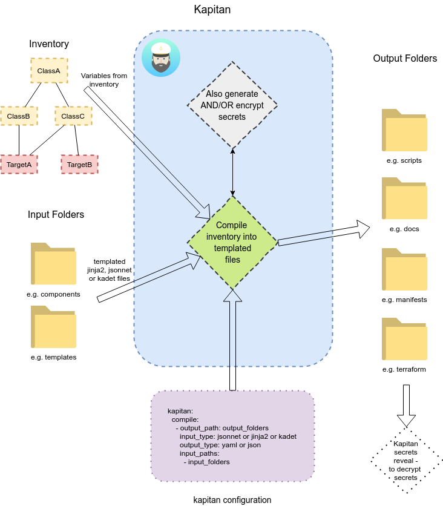

# Kapitan Overview

## Main concepts



## Inventory

Inventory is a hierarchical database of variables, defined in yaml files, that are passed to the targets during compilation. This will be explained in detail in the [inventory](inventory.md) section of the documentation.

## Components (templates)

Components will receive the inventory values for each individual target and gets rendered and saved into the `compiled` directory. The types of available templates and how to use them is discussed in the [compile operation](compile.md) section of the documentation.

## Typical Folder Structure

### kapitan init

To start off a kapitan project, you can run `kapitan init --directory <directory>` to populate a new directory with the recommended kapitan folder structure.

The bare minimum structure that makes use of kapitan features may look as follows:

```text
.
├── components
│   ├── mycomponent.jsonnet
├── templates
├── ├── README.md
├── inventory
│   ├── classes
│   │   ├── common.yml
│   └── targets
│       ├── dev.yml
│       ├── staging.yml
│       └── prod.yml
├── refs
│   ├── targets
│   │   ├── prod
│   │   │   └── password
└───├── common
        └── example-com-tls.key
```

- `components`: stores jsonnet files each of which corresponds to an application (for example)
- `templates`: stores Jinja2 and Kadet templates
- `inventory/targets`: stores target files
- `inventory/classes`: stores inventory values to be inherited by targets
- `refs`: stores secrets referenced inside the inventory

### Example: kubernetes deployment

Refer to the structure below for more production-like uses of kapitan for kubernetes deployment:

```text
.
├── components
│   ├── elasticsearch
│   │   ├── configmap.jsonnet
│   │   ├── deployment.jsonnet
│   │   ├── main.jsonnet
│   │   └── service.jsonnet
│   └── nginx
│       ├── configmap.jsonnet
│       ├── deployment.jsonnet
│       ├── main.jsonnet
│       ├── nginx.conf.j2
│       └── service.jsonnet
├── inventory
│   ├── classes
│   │   ├── cluster
│   │   │   ├── cluster1.yml
│   │   │   └── cluster2.yml
│   │   ├── component
│   │   │   ├── elasticsearch.yml
│   │   │   ├── nginx.yml
│   │   │   └── zookeeper.yml
│   │   └── environment
│   │       ├── dev.yml
│   │       └── prod.yml
│   └── targets
│       ├── dev-cluster1-elasticsearch.yml
│       ├── prod-cluster1-elasticsearch.yml
│       └── prod-cluster2-frontend.yml
├── refs
│   ├── targets
│   │   ├── prod-cluster1-elasticsearch
│   │   │   └── password
│   ├── common
│   │   └── example-com-tls.key
├── lib
    ├── kapitan.libjsonnet
    └── kube.libjsonnet
```

The use of each file in this folder will become clear in the the subsequent documentations.
