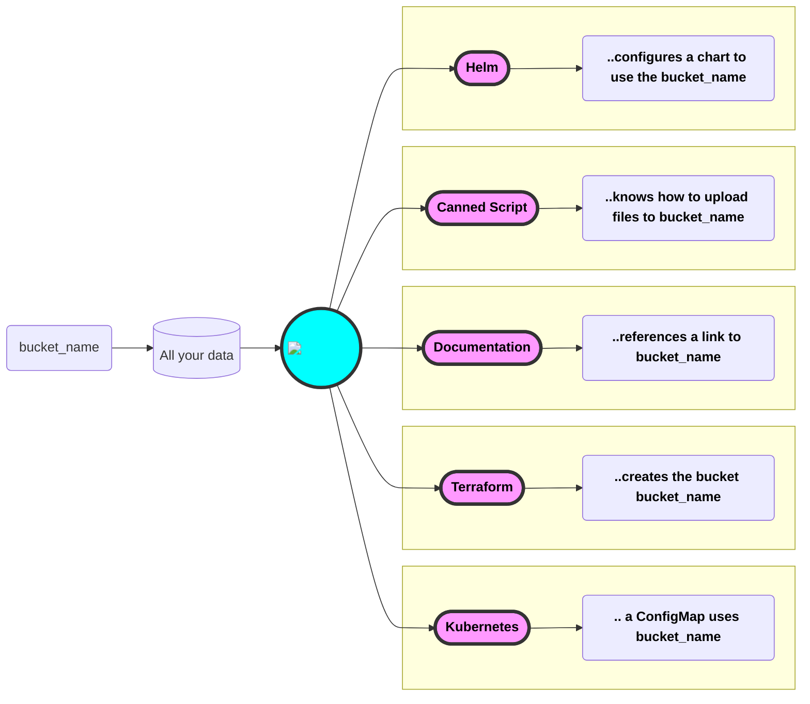

# :kapitan-logo: **5 Years** of **Kapitan**

Last October we quietly celebrated [5 years of **Kapitan**](https://github.com/kapicorp/kapitan/releases/tag/v0.9.14).

In 5 years, we've been able to witness a steady and relentless of Kapitan, which has however never caught the full attention of the majority of the community.

The main issue has always been around an embarassing lack of **documentation**, and we've worked hard to improve on that, with more updates due soon.

Let this first blog post from a revamped website be a promise to our community of a better effort in explaining what sets **Kapitan** apart, and makes it the only tool of its kind.

And let's start with a simple question: Why do you even need **Kapitan**?

<!-- more -->

!!! info ":kapitan-logo: Credits  :heart:"
        In reality Kapitan's heatbeat started about 9 months earlier at DeepMind Health, created by [**Ricardo Amaro**](https://github.com/ramaro) with the help of some of my amazing team: in no particular order [Adrian Chifor](https://github.com/adrianchifor), [Paul S](https://github.com/uberspot) and [Luis Buriola](https://github.com/gburiola). It was then kindly released to the community by Google/DeepMind and is has so been improved thanks to more than [50 contributors](https://github.com/kapicorp/kapitan/graphs/contributors).

## Why do I need **Kapitan**?

**Kapitan** is a hard sell, but a rewarding one. For these main reasons:

1. **Kapitan** solves problems that some don’t know/think to have.
2. Some people by now have probably accepted the ***Status Quo*** and think that some suffering is part of their job descriptions.
3. Objectively, **Kapitan** requires an investment of effort to learn how to use a new tool, and this adds friction.

All I can say it is very rewarding once you get to use it, so stick with me while I try to explain the problems that **Kapitan** is solving

## The problems

It would be reductive to list the problems that **Kapitan** solves, because sometimes we ourselves are stunned by what **Kapitan** is being used for, so I will start with some common relatable ones, and perhaps that will give you the right framing to understand how to use it with your setup.

In its most basic explanation, **Kapitan** solves the problem of avoiding duplication of *configuration data*: by consolidating it in one place (the [**Inventory**](../../inventory/introduction.md)), and making it accessible by all the tools and languages it integrates with (see [**Input Types**](../../input_types/introduction.md)).

This *configuration data* is then used by **Kapitan** (templates) to configure and operate a number of completely distinct and unaware tools which would normally not be able to share their configurations.

### Without **Kapitan**

Let's consider the case where you want to define a new bucket, with a given `bucket_name`. Without **Kapitan** you would probably need to:

* Write a PR on your **Terraform** repository to create the new bucket.
  * Which name should I use? Make sure to write it down! **`CTRL-C`**
* Write a PR for your `values.yaml` file to configure your **Helm** chart: **`<CTRL-V>`**
* Write somewhere some documentation to write down the bucket name and why it exists. Another **`<CTRL-V>`**
* Another PR to change some `**kustomize**` configuration for another service to tell it to use the new bucket **`<CTRL-V>`**
* Days after, time to upload something to that bucket: `gsutil cp my_file wait_what_was_the_bucket_name_again`.. Better check the documentation: **`CTRL-C`** + **`<CTRL-V>`**

### With **Kapitan**

When using Kapitan, your changes are likely to be contained within one PR, from which you can have a full view of everything that is happening. What happens is explained in this flow

Thanks to its flexiblility, you can use **Kapitan** to generate all sorts of configurations: Kubernetes and Terraform resources, ArgoCD pipelines, Docker Compose files, random configs, scripts, documentations and anything else you find relevant.
The trick is obviously on how to drive these changes, but it is not as complicated as it sounds. We'll get there soon enough!

Let's see now another example of things that are so established in the way to do things that become elusivly impossible to see. As a way to highlight the potential issues with this way of doing things, let's ask some questions on your current setup. We pick on **Kubernetes** this time.

## Kubernetes

I’ll start with **Kubernetes**, such a popular and brilliant solution to problems most people should not be concerned with (jokes apart, I adore Kubernetes).
To most, **Kubernetes** is that type of solution that quickly turns into a problem of its own right.

> So.. how do you deploy to Kubernetes right now?

**Helm** comes to mind first, right?

!!! note ":kapitan-logo: **Kapitan** + **Helm**: BFF :heart:"
    In spite of **Kapitan** being initially considered (even by ourselves) as an alternative to **Helm**, we’ve actually enjoyed the benefits of integrating with this amazing tool and the ecosystem it gives us access to. So yes, good news: you can use **Helm** right from within **Kapitan**!.

Well, let’s put that to a test. How do you manage your **Helm** charts? I’ll attempt to break these questions down into categories.

=== "Code Organization"
    !!! note ""
         * Where do you keep your **Helm** charts?
             * In a single repository?
             * How many repositories?
             * Alongside the code you develop?
         * What about the official ones that you didn't create yourself?

=== "DRY"
    !!! note ""
         * How many `values.yaml` files do you have?
         * How much consistency is there between them? any ***snowflakes***?
         * If you change something, like with the `bucket_name` example above:
             * how many places do you need to go and update?
             * And how many times do you get it wrong?
         * Don't you feel all your charts look the same?
             * Yet how many times do you need to deviate from the one you thought captured everything?
             * What if you need to make a change to all your charts at once: how do you deal with it?
         * What about configuration files, how do you deal with templating those?

=== "Maintenance"
    !!! note ""
          * How do you deal with “official” charts, do they always cover what you want to do?
          * How do you deal with modifications that you need to apply to your own version of a an official chart?
          * What if you need to make a change that affects ALL your charts?
          * Or if the change is for all the charts for a set of microservices?

=== "Operations"
    !!! note ""
         * How many times you find yourself seting parameters on the command line of **Helm** and other tools?
         * How many times did you connect to the wrong context in **Kubernetes**
         * How many of your colleagues have the same clean context setup as you have?
         * How many things are there that you wish you were tracking?
         * How do I connect to the production database? Which user is it again?
         * How easy is it for you to create a new environment from scratch?
             * Are you sure?
             * When was the last time you tried?

=== "Documentation"
    !!! note ""
          * How easy is it to keep your configuration up to date?
          * Does your documentation need to be “understood” or can be just executed on?
            * How many conditionals like this do you have in your documentation?
            > NOTE: Cluster X in project Y has an older version of Q and requires you to do Z instead N because of A, B and C!
          * Would you be able to follow those instructions at 3am on a Sunday morning?

=== "Secrets management"
    !!! note ""
         * How do you handle secrets in your repository?
         * Do you know how to create your secrets from scratch?
         * Do you remember that token you created 4 months ago? How did you do that?
         * How long would it take you?
         * Is the process of creating them “secure”?
             * Or does it leave you with random certificates and tokens unencrypted on your “Downloads” folder?

=== "Everything else"
    !!! note ""
          * The above concerns: do they also apply to other things you manage?
          * Terraform?
          * Pipelines?
          * Random other systems you interact with?

I’ll stop here because I do not want to lose you, and neither do I want to discourage you.

But if you look around it’s true, you do have a very complicated setup. And **Kapitan** can help you streamline it for you. In fact, **Kapitan** can leave you with a consistent and uniform way to manage all these concerns at once.

My job here is done: you have awakened and you won't look at your setup in the same way. Keep tuned and learn about how **Kapitan** can change the way you do things.
