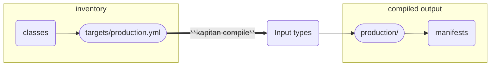

# :kapitan-logo: **Kapitan Core Concepts**

**Kapitan** essentially allows you to organise your data with the **`inventory`**, and uses it to configure and run multiple [**`Input Types`**](input_types/introduction.md) which generate files.

> So you can essentially *compose* your configuration using your favourite tools.



**Kapitan** supports multiple [**`Input Types`**](input_types/introduction.md), and the support keeps growing.

* [**Helm Charts**](input_types/helm.md)
* [**jsonnet**](input_types/jsonnet.md)
* [**Python**](input_types/kadet.md)
* [**Jinja2**](input_types/jinja.md)

## [**Targets**](inventory/targets.md)
**Kapitan** organises your configuration through [**targets**](inventory/targets.md).

A simple target is typically made of a `classes` and a `parameters` sections, and it looks like this:

```yaml
# inventory/targets/production.yaml
classes:
  - common
  - acme.applications.super

parameters:
    description: My Super Application
```

## **Compiling targets**

You can tell **Kapitan** to **compile** all your targets by running the following command in a valid kapitan repository root:

```
$ kapitan compile
Rendered inventory (0.06s): discovered 200 targets.
Compiling 200/200 targets using 64 concurrent processes: (64 CPU detected)
...
Compiled production (0.68s)
...
Compiled 200 targets in 20s
```

Alternatively, you can select just the target you want to compile, using the `-t` or `--target` flag:

```
$ kapitan compile -t production
Rendered inventory (0.06s): discovered 200 targets.
Compiling 1/200 targets using 1 concurrent processes: (64 CPU detected)
Compiled production (0.68s)
Compiled 1 targets in 0.73s
```

## **Targets outputs**

The output of a target compilation gets copied under the *`compiled`* folder, with the same structure as the original target.

<div class="grid">

```tree result="shell"
inventory/
    targets/
        production.yml    #  --->
```

```tree result="shell"
compiled/
    ...
    production/           # compiled output
        README.md
        scripts/
        manifests/
        terraform/
        ...
```
</div>

The files or directories being created depends on what is defined inside the targets, and will change based on the configuration you define in the **Kapitan** target.

## **Organising targets**

You can organise targets in a directory structure, and **Kapitan** will mimic the structure in the *`compiled`* folder

!!! note "How targets are named"

    Kapitan identifies targets by a name that is automatically constructed based on the directory structure under the **`inventory/targets`** folder.

    **`teams/devops/grafana.yml`** becomes **`teams.devops.grafana`**

<div class="grid">

```tree result="shell"
inventory/
    targets/
        teams/
            devops/
                grafana.yml # teams.devops.grafana
```

```tree result="shell"
compiled/
    teams/
        ...
        devops/
            grafana/    # teams.devops.grafana
                scripts/
                manifests/
                terraform/
```
</div>

## [**Classes**](inventory/classes.md)

**Kapitan** allows you to organise your shared inventory data using [**classes**](inventory/classes.md), which are found in the *`inventory/classes`* folder.

```tree result="shell"
inventory/
    classes/
        common.yml              # common
        teams/
            project1/
                config.yml      # teams.project1.config
            project2/
                config.yml      # teams.project2.config
                kubernetes.yml  # teams.project2.kubernetes
```

The structure of a class is very similar to target files. Classes can refer to other classes.

```yaml
# inventory/classes/common.yaml
classes:
    - kapitan.common

parameters:
    organization: ACME
    headquarters: London
    timezone: Europe/London
```
