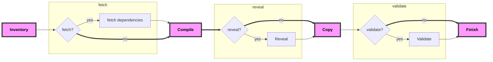

# Introduction

**Note:** make sure to read up on [inventory](../inventory/introduction.md) before moving on.

## Phases of the compile command

Now that we have a basic understanding of Kapitan `inventory`, we can talk about the `kapitan compile` command.

The command has five distinct `phases`:



| Step          | Flag         | Description                                                              | Configuration                     |
|---------------|--------------|--------------------------------------------------------------------------|-----------------------------------|
| **Inventory** |              | **Kapitan** uses **reclass** to render a final version of the inventory. |                                   |
| **Fetch**     | `--fetch`    | **Kapitan** fetches external dependencies                                | `parameters.kapitan.dependencies` |
| **Compile**   |              | **Kapitan** compiles the input types for each target                     | `parameters.kapitan.compile`      |
| **Reveal**    | `--reveal`   | **Kapitan** reveals the secrets directly in the compiled output          | `parameters.kapitan.secrets`      |
| **Copy**      |              | **Kapitan** moves the output files from the tmp directory to `/compiled` |                                   |
| **Validate**  | `--validate` | **Kapitan** validates the schema of compiled output.                     | `parameters.kapitan.validate`     |
| **Finish**    |              | **Kapitan** has completed all tasks                                      |                                   |

## Supported input types

Input types can be specified in the inventory under `kapitan.compile` in the following format:

=== "jinja2"
    ```yaml
    parameters:
      kapitan:
        compile:
        - output_path: <output_path_in_target_dir>
          input_type: jinja2
          input_params: # (1)!
          input_paths:
            - directory/
            - file
            - globbed/path/*
    ```

    1. a dict passed to the template

    Please see [**Jinja**](jinja.md)

=== "jsonnet"
    ```yaml
    parameters:
      kapitan:
        compile:
        - output_path: <output_path_in_target_dir>
          input_type: jsonnet
          prune: false # (1)!
          input_paths:
            - directory/
            - file
            - globbed/path/*
          output_type: [`yaml` | `json`]
    ```

    1. (Default: global --prune)

=== "kadet"
    ```yaml
    parameters:
      kapitan:
        compile:
        - output_path: <output_path_in_target_dir>
          input_type: kadet
          prune: false # (1)!
          input_paths:
            - directory/
            - file
            - globbed/path/*
          output_type: [`yaml` | `json`]
    ```

    1. (Default: global --prune)

    Please see [**Kadet**](kadet.md)

=== "helm"
    ```yaml
    parameters:
      kapitan:
        compile:
        - output_path: <output_path_in_target_dir>
          input_type: helm
          prune: false # (1)!
          input_paths:
            - directory/
            - file
            - globbed/path/*
          output_type: <output_type_specific_to_input_type>
    ```

    1. (Default: global --prune)

=== "copy"
    ```yaml
    parameters:
      kapitan:
        compile:
        - output_path: <output_path_in_target_dir>
          input_type: copy
          prune: false # (1)!
          input_paths:
            - directory/
            - file
            - globbed/path/*
          output_type: <output_type_specific_to_input_type>
    ```

    1. (Default: global --prune)
