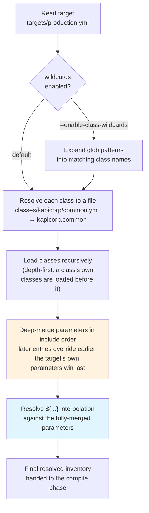

# :kapitan-logo: **What is the inventory?**

The **Inventory** is a core component of Kapitan: this section aims to explain how it works and how to best take advantage of it.

The **Inventory** is a hierarchical `YAML` based structure which you use to capture anything that you want to make available to **Kapitan**, so that it can be passed on to its templating engines.

```
inventory/
├── classes/
│   ├── common/
│   │   └── base.yml        # Foundational configurations
│   ├── components/
│   │   └── web/            # Component-specific settings
│   └── environments/
│       └── production.yml  # Environment-specific configurations
└── targets/
    └── production/
        └── web.yml         # Specific deployment configurations
```

The **Kapitan** inventory is divided between [**targets**](targets.md) and [**classes**](classes.md).

Both classes and targets are yaml file with the same structure

```yaml
classes:
  - common
  - my.other.class

parameters:
  key: value
  key2:
    subkey: value
```

[**Classes**](classes.md) are found by default under the [`inventory/classes`](classes.md) directory and define common settings and data that you define once and can be included in other files. This promotes consistency and reduces duplication.

Classes are identified with a name that maps to the directory structure they are nested under.
In this example, the `kapicorp.common` class represented by the file `classes/kapicorp/common.yml`

```
# classes/kapicorp/common.yml
classes:
  - common

parameters:
  namespace: ${target_name}
  base_docker_repository: quay.io/kapicorp
  base_domain: kapicorp.com
```

[**Targets**](targets.md) are found by default under the [`inventory/targets`](targets.md) directory and represent the different environments or components you want to manage. Each target is a YAML file that defines a set of configurations.

For example, you might have targets for **`production`**, **`staging`**, and **`development`** environments.

```
# targets/production.yml
classes:
  - kapicorp.common
  - components.web
  - environments.production

parameters:
  target_name: web
```


By combining [**target**](targets.md) and [**classes**](classes.md), the **Inventory** becomes the SSOT for your whole configuration, and learning how to use it will unleash the real power of **Kapitan**.

---

## How the inventory is built

Before any input type runs, **Kapitan** turns a target file and its class graph
into a single, fully-resolved set of `parameters`. Understanding the order of
these steps explains *why* a value overrides another, and *when* a `${...}`
reference gets its value.



1. **Read target** — the target file is the entry point. Its `classes:` list
   drives everything that follows.
2. **Expand wildcards** *(optional)* — with
   [`--enable-class-wildcards`](classes.md#wildcard-class-patterns), glob
   patterns in `classes:` are expanded to concrete class names *before* the
   backend sees them. Without the flag, entries pass through unchanged.
3. **Resolve & load classes** — each class name maps to a file under
   `inventory/classes/`. Classes are loaded **recursively and depth-first**: a
   class's own `classes:` are loaded before the class itself, so foundational
   data lands first.
4. **Merge parameters** — `parameters` blocks are **deep-merged** in the order
   classes are encountered. **Later entries override earlier ones**, and the
   target's own `parameters` are merged last, giving them the highest
   precedence. This is why list position in `classes:` matters (see the
   [override-order warning](classes.md#wildcard-class-patterns) for wildcards).
5. **Resolve interpolation** — only **after** the full merge are `${...}`
   references resolved, against the final merged values. A reference therefore
   sees the *winning* value regardless of which class defined it.
6. **Final inventory** — the resolved `parameters` are handed to the
   [compile phase](../input_types/introduction.md#phases-of-the-compile-command),
   which feeds each input type.

!!! note "Backend differences"
    The merge-then-resolve model above is the shared mental model. The
    [`reclass`](backends.md) and `reclass-rs` backends follow it directly;
    the [`omegaconf`](omegaconf.md) backend uses a **double-pass** resolution to
    support escaped interpolations. Test inventory changes against every backend
    you support.

---

## Next steps

- Learn how to define environments and deployments with [Kapitan inventory targets](targets.md).
- Understand how to compose reusable configuration with [Kapitan inventory classes](classes.md).
- Discover how to reference values across the inventory with [parameter interpolation](parameters_interpolation.md).
- Explore [advanced inventory features](advanced.md) such as target labels and inventory backends.
- See how the inventory drives [input types](../input_types/introduction.md) like [Jsonnet](../input_types/jsonnet.md), [Jinja](../input_types/jinja.md), and [Helm](../input_types/helm.md).
