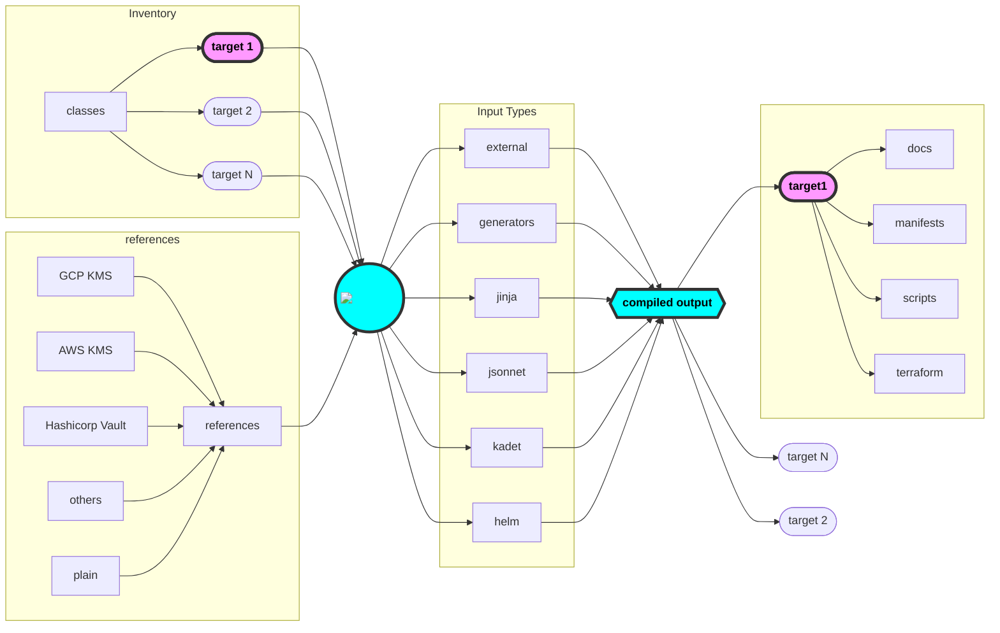

# :kapitan-logo: **Kapitan Overview**

## **Kapitan** at a glance

**Kapitan** is a powerful configuration management tool designed to help engineers manage complex systems through code. It centralizes and simplifies the management of configurations with a structured approach that revolves around a few core concepts. 

Let's explore these concepts in a way that's accessible to new users:

## Core Concepts of Kapitan

### Inventory: The Backbone

At the core of **Kapitan** lies the Inventory, a structured database of variables meticulously organized in YAML files. 
This hierarchical setup serves as the single source of truth (SSOT) for your system's configurations, making it easier to manage and reference the essential components of your infrastructure. Whether you're dealing with Kubernetes configurations, Terraform resources, or even business logic, the Inventory allows you to define and store these elements efficiently. This central repository then feeds into **Kapitan**'s templating engines, enabling seamless reuse across various applications and services.

### Templating with Input Types

**Kapitan** takes the information stored in the Inventory and brings it to life through its templating engines upon compilation. This process transforms static data into dynamic configurations, capable of generating a wide array of outputs like Kubernetes manifests, Terraform plans, documentation, and scripts. It's about making your configurations work for you, tailored to the specific needs of your projects.

#### Getting Started with Generators

Generators offer a straightforward entry point into using **Kapitan**, requiring minimal to no coding experience. These are essentially pre-made templates that allow you to generate common configuration files, such as Kubernetes manifests, directly from your Inventory data. **Kapitan** provides a wealth of resources, including the **Kapitan** Reference repository and various blog posts, to help users get up and running with generators.

#### Kadet: Advanced Configuration with Python

For those looking to leverage the full power of **Kapitan**, Kadet introduces a method to define and reuse complex configurations through Python. This internal library facilitates the creation of JSON and YAML manifests programmatically, offering a higher degree of customization and reuse. Kadet empowers users to craft intricate configurations with the simplicity and flexibility of Python.

### **Kapitan** References: Your Flexible Configuration Superpower

**Kapitan** references provide a secure way to store passwords, settings, and other essential data within your project. Think of them as special code placeholders.
Flexibility: Update a password once, and Kapitan updates it everywhere automatically.
Organization: References tidy up your project, especially when you're juggling multiple settings or environments (dev, staging, production).
Security: Protect sensitive information like passwords with encryption

!!! tip

    Use [Tesoro](https://github.com/kapicorp/tesoro), our **Kubernetes Admission Controller**, to complete your integration with Kubernetes for secure secret decryption on-the-fly.

## Credits

* [Jsonnet](https://github.com/google/jsonnet)
* [Jinja2](http://jinja.pocoo.org/docs/2.9/)
* [reclass](https://github.com/salt-formulas/reclass)

*[SSOT]: Single Source Of Truth
